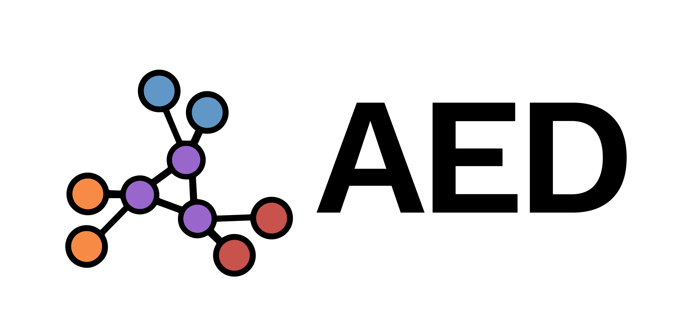

<div align="center">
    
    <h1>Repte AED - Datathon FME 2024</h1>
</div>

## Overview

While brainstorming this year's challenges, we realized that one of the most interesting data problems was right in front of us - the team formation process at Datathon FME itself! 

Every year we see amazing participants joining with different goals in mind - from prize-hunting and portfolio-building to learning new skills and meeting fellow data nerds. Some come with their squad ready to go, but many dive into our Discord channels hoping to find their dream team. We think that this process can be streamlined to make it easier for participants to find their perfect teammates.

This is where you come in! We're challenging you to build something that could revolutionize how future participants find their teammates. Not an automated team assigner, but smart tools that help participants connect with like-minded people efficiently - matching both technical skills and hackathon goals. Your solution could transform the team formation experience for future AED generations!


## Challenge Objectives

Create a team formation system that matches datathon participants based on their characteristics and objectives, ensuring balanced and complementary teams while providing clear insights into team compositions. The system should consider both technical compatibility and alignment of participant goals. Teams up to 4 participants.

Make sure to create appropriate visualizations and dashboards to help participants understand the team formation process and the composition of their teams.

## Quick Start

1. [Clone this repository](https://docs.github.com/en/repositories/creating-and-managing-repositories/cloning-a-repository) with Git, GitHub Desktop or by downloading the ZIP file.

```bash
git clone https://github.com/data-students/AEDChallenge
```

2. Install [Python](https://www.python.org/downloads/) (3.10 or higher)

3. Enter the project directory

```bash
cd AEDChallenge
```

4. Install the project dependencies using [pip](https://pip.pypa.io/en/stable/getting-started/)

```bash
pip install -r requirements.txt
```

5. Run the example

```bash
python example.py
```

## Documentation

### Participant

The `Participant` class is a dataclass that represents a participant in the datathon. It contains all the information about a participant, including their personal data, experience and skills, interests, preferences and constraints.

1. `id`: A unique identifier for the participant. This is automatically generated when the participant is created.
2. `name`: The name of the participant. It may contain [Non-ASCII characters](https://blog.jpalardy.com/posts/dealing-with-non-ascii-characters/)
3. `email`: The email of the participant.
4. `age`: The age of the participant.
5. `year_of_study`: The year of study of the participant. It can be one of the following: "1st year", "2nd year", "3rd year", "4th year", "Masters", "PhD".
6. `shirt_size`: The shirt size of the participant. It can be one of the following: "S", "M", "L", "XL".
7. `university`: The university of the participant.
8. `dietary_restrictions`: The dietary restrictions of the participant. It can be one of the following: "None", "Vegetarian", "Vegan", "Gluten-free", "Other".
9. `programming_skills`: The programming skills of the participant. It is a dictionary with programming languages or tools as keys and integers as values. The integers represent the skill level, which can be one of the following: 1, 2, 3, 4, 5.
10. `experience_level`: The experience level of the participant. It can be one of the following: "Beginner", "Intermediate", "Advanced".
11. `hackathons_done`: The number of hackathons done by the participant.
12. `interests`: The interests of the participant. It is a list of strings, each string representing an interest. 
13. `preferred_role`: The preferred role of the participant. It can be one of the following: "Analysis", "Visualization", "Development", "Design".
14. `objective`: The objective of the participant. This is a response to the a free-form question "What are you looking for at Datathon FME 2024?". The response is usually related to one of: "prize-hunting", "portfolio-building", "learning new skills", "meeting new people".
15. `interest_in_challenges`: The interest in challenges of the participant. It is a list of strings, each string representing a challenge. 
16. `preferred_languages`: The preferred languages of the participant. It is a list of strings, each string representing a programming language.
17. `friend_registration`: The list of friends of the participant. It is a list of UUIDs, each UUID representing a participant.
18. `preferred_team_size`: The preferred team size of the participant. It is an integer between 1 and 5.
19. `availability`: The availability of the participant. It is a dictionary with days and times as keys and boolean values as values.
20. `introduction`: The introduction of the participant. This is a response to the free-form question "Tell us about yourself".
21. `technical_project`: The technical project of the participant. This is a response to the free-form question "Tell us about a project you’ve enjoyed working on, technical or non-technical.".
22. `future_excitement`: The future excitement of the participant. This is a response to the free-form question "What’s something you’re excited to work on in the next 10 years? Dream big!".
23. `fun_fact`: The fun fact of the participant. This is a response to the free-form question "Tell us a fun fact about you :".
